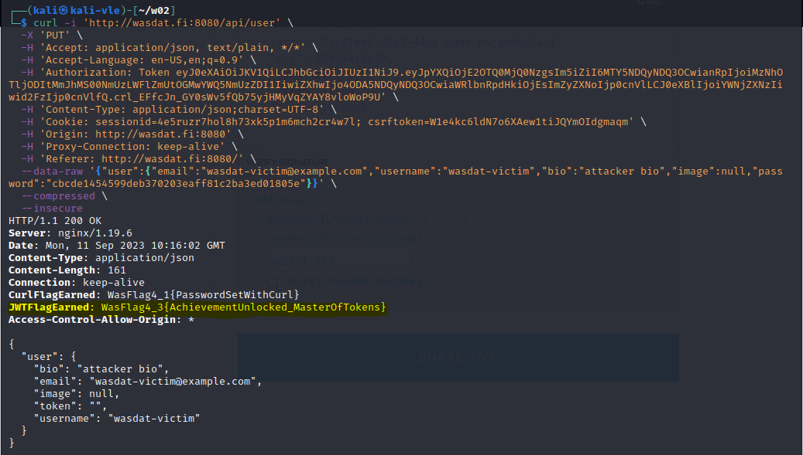

# Web Application Security

**Student number:** AB0197  
**Name:** Veeti Hakala    
**Group:** TIC21S  
**Time management:** Approximately 10 hours


## Week 02  

### Cross-Site Scripting:

#### Juice Shop - DOM XSS + Bonus Payload

**Title:** Create a DOM based XSS in Juice Shop.

**Description:** Juice Shop allows `html` inputs in search field.

**Steps to produce:**  

1. Navigate to `https://wasdat.fi:3000/`.
2. Open products view and select search field as active.
3. Use script <iframe>....</iframe>.
4. Alert box shows xss message.
4. For the bonus payload, use script <iframe></iframe>
5. Alert box shows the bonus payload.


* Impact estimation: **High Severity**
    1. Unauthorized Account Access: The vulnerability enables malicious actors to modify the password of any user account without knowing the original password. This can lead to unauthorized access to sensitive account information, manipulation of account settings, or misuse of the account in malicious activities.
    * See: https://cwe.mitre.org/data/definitions/620.html
    2. Potential for Mass Account Compromises: Given the ease with which this vulnerability can be exploited (using CURL), there is a risk of automated attacks, potentially compromising a large number of user accounts.
    3. Data Leakage: Post unauthorized access, sensitive personal information related to the user might be accessed, leading to privacy breaches.

* Mitigation:
    * Implement Old Password Check: Before allowing a user to change their password, they should be prompted to enter their current (old) password. This will ensure that only the legitimate owner of the account (or someone who has the current password) can change the password.
        * See: https://cheatsheetseries.owasp.org/cheatsheets/Authentication_Cheat_Sheet.html#change-password-feature
    * Multi-Factor Authentication (MFA): Encourage or enforce users to set up multi-factor authentication. Even if an attacker changes the password, they will be unable to login without the second factor.


---

#### Main target - Stored XSS (Type 2)

**Title:** Find vulnerable page from `wasdat.fi` and inject stored `XSS` to vulnerable element.

**Description:** Wasdat.fi allows regular user to create new products. Text input fields allows to use `html`, so it is vulnerable to `XSS` attack. `Stored XSS` is type 2 = `html injection.`

**Steps to produce:**  

1. Navigate to `https://wasdat.fi/`.
2. Create a user & login in to the website.
3. Go to your profile and select 'Create new product'.
4. Craft XSS payload with student id:
    4. <iframe>alert.(`xss.ab0197`)</iframe>
4. Go back to products page and scroll down to bottom. 
5. New product is added on the bottom and clicking the product will popup and alert box with `xss.ab0197` message.


* Impact estimation: **Critical**
    * Unauthorized Account Access: The vulnerability allows attackers to modify JWT tokens and change user passwords without knowing the original ones. Such unauthorized access can lead to data breaches, account misuse, and unauthorized changes to user settings.

    * Impersonation: By manipulating the JWT token, an attacker might be able to impersonate any user, potentially gaining access to privileged accounts.

    * Potential for Mass Account Takeovers: Given the nature of JWT and its widespread usage, attackers can script attacks to potentially compromise numerous accounts.

    * Data Leakage: Successful exploitation could lead to unauthorized access and exfiltration of sensitive user data.

* Mitigation:
    * Disallow "none" Algorithm: Update the JWT processing logic to reject tokens that specify the "none" algorithm unless they are expected and strictly required for a specific reason.
        * See: https://auth0.com/blog/a-look-at-the-latest-draft-for-jwt-bcp/
    * Implement Stronger Signature Verification: Ensure that all JWT tokens are verified using a robust and secure method before being processed.
    * Auditing and Monitoring: Introduce logging mechanisms for authentication and token processing. Monitor these logs for anomalies, such as repeated failed login attempts or unexpected use of the "none" algorithm.
    * Update Libraries: Ensure that you are using the latest and most secure version of JWT processing libraries. Many libraries have addressed vulnerabilities related to the "none" algorithm.

* Related OWASP CWE:
    * CWE-347: Improper Verification of Cryptographic Signature
    * CWE-306: Missing Authentication for Critical Function
    * CWE-287: Improper Authentication

---


#### Old wasdat - Craft JWT token with known secret and impersonate to be the victim :

**Title:** JWT Token `secret` has leaked, which is librarys default value.

**Description:** Web application has vulnerability in the JWT Token `secret`. It is using default value. Any user can impersonate other users because authentication is always validated if secret is known and is used in the `http payload`.

**Steps to produce:**  
1. Vulnerable field was already given: Get / `http://wasdat.fi:3000/rest/products/search?q=`.
2. Use SQL Map to find database type, and schema.
3. Open Kali linux and run command:
    3. > sqlmap -u http://wasdat.fi:3000/rest/products/search?q= --dbs --level=3 --risk=3
    4. > sqlmap -u sqlmap -u http://wasdat.fi:3000/rest/products/search?q= --current-db --tables
    5. > sqlmap -u sqlmap -u http://wasdat.fi:3000/rest/products/search?q= --current-db -T Users --columns
4. Now we know that database is `SQLite`.  Database has `Users` table.
5. Navigate to `https://wasdat.fi:3000/`, click search field as active.
6. Search with: `http://wasdat.fi:3000/rest/products/search?q=')) ORDER BY 1--`
4. `500 Error: SQLITE_ERROR: 1st ORDER BY term out of range - should be between 1 and 9`
5. GET `http://wasdat.fi:3000/rest/products/search?q=%27))%20UNION%20SELECT%201,2,3,4,5,6,7,8,9--`
```
HMACSHA256(
  base64UrlEncode(header) + "." +
  base64UrlEncode(payload),
) 
``` 
6. Add `secret-key` to signature:

  
```
    HMACSHA256(
    base64UrlEncode(header) + "." +
    base64UrlEncode(payload),
    secret-key
    ) 
``` 

7. Decode it again and replace old value in the Authentication Token field.
7. Run curl command from kali cli.
8. You'll get flag: `JWTFagEarned: WasFlag4_3{AchievementUnlocked_MasterOfTokens}`




* Impact estimation: **Critical**
    * Unauthorized Account Access: Attackers who know the JWT secret can generate or modify JWT tokens, potentially leading to unauthorized access to any account, including admin or privileged ones.
    * Impersonation: With the ability to manipulate the JWT token, an attacker can impersonate any user, gaining unauthorized access to potentially sensitive user data and operations.  

* Mitigation:
    1. Change the JWT Secret: Immediately rotate the JWT secret to a complex, unique value that is not based on any default or easily guessable value.

    2. Secure Secret Management: Ensure that secrets are stored securely, such as in environment variables, secret management tools, or encrypted databases. They should never be hardcoded in the application or leaked in repositories.

    3. Implement Stronger Signature Verification: Ensure that all JWT tokens are verified against the secret before being processed. Ensure the use of strong cryptographic algorithms for signing.

    4. Periodic Secret Rotation: Establish a policy to rotate secrets periodically, thus reducing the window of exposure should they ever be compromised.

    5. Auditing and Monitoring: Implement strict logging and monitoring mechanisms. Be alert for suspicious activities, such as unexpected spikes in login attempts or unauthorized data access patterns.

    6. User Notification: Notify affected users about the vulnerability. Encourage password resets and review of account activities.

    7. Update Libraries and Dependencies: Ensure the usage of updated, secure versions of JWT processing libraries and other dependencies.

* Related OWASP CWE:  
    * CWE-326: Inadequate Encryption Strength

    * CWE-347: Improper Verification of Cryptographic Signature.

    * CWE-798: Use of Hard-coded Credentials

    * CWE-359: Exposure of Private Information ('Privacy Violation')

---

