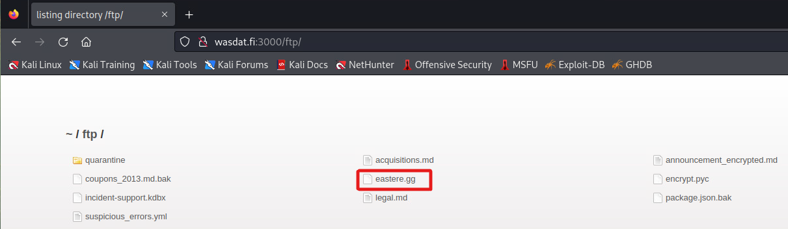
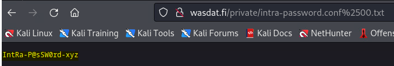

# Web Application Security

**Student number:** AB0197  
**Name:** Veeti Hakala    
**Group:** TIC21S  
**Time management:** Approximately 10 hours

## Week 04  

### Insecure Design:

#### Juice Shop - Easter

**Title:** Find Easter Egg from Juice Shop.

**Description:** Juice Shop allows `html` inputs in the search field, which can potentially leak sensitive or unnecessary information. Furthermore, the misconfiguration in the `robots.tx` file gives attackers an indication of the existence of sensitive directories, leading to further information exposure.  

**Steps to produce:**  

1. Use directory scan tool for `http:wasdat.fi:3000/`. I used `dirb`.
2. Using dirb: run command `dirb http:wasdat.fi:3000/`.  

  

3. Open browser and inspect `robots.txt` for configuration.  
    3. Write in browser url: `http:wasdat.fi:3000/robots.txt`  
    3.     

4. Running `dirb` on this directory will result an error because contents of this directory aren't indexed.
    4. Error when trying to run dirb on `ftp` directory: `WARNING: All responses for this directory seem to be CODE = 403.`.  

5. Let's try to open with browser url: `http:wasdat.fi:3000/ftp`  
    5.   

6. We found file `eastere.gg`, open it up in browser: `http://wasdat.fi:3000/ftp/eastere.gg`  

7. We got response, but unfortunately only `.md` or `.pdf` is allowed.  
    7. 

8. Let's try `poison null byte` by adding `%2500` value in the url.
    8. `http://wasdat.fi:3000/ftp/eastere.gg%2500.md`

9. Wolah, we got the egg we were looking for on this challenge: 
    

* Impact estimation: **Medium Severity**

    * Exposure of non-public files or directories.
    Potential to be leveraged in conjunction with other vulnerabilities.  

    * Leakage of potentially sensitive information.
    Giving attackers potential targets or hints for further attacks.

* Mitigation:

    *Ensure that all unnecessary files, directories, and endpoints are removed from the production version of the application.  

    * Properly configure the robots.txt to avoid leaking sensitive directory or file information. It's important to note that while robots.txt can prevent well-behaving bots from scanning directories, it doesn't prevent malicious users from manually exploring these directories.  

    * Use a more robust method for security through obscurity, such as strong access controls and authentication measures.  

    * Regularly perform security assessments or vulnerability scans on web applications to identify and fix potential vulnerabilities.  

    * Avoid exposing file extensions and instead, provide unique IDs or URLs that do not disclose the nature or purpose of underlying resources.  

    * Validate and sanitize all user inputs to prevent potential exploitation.

* Related OWASP CWE:

    * CWE-200: Information Exposure – This vulnerability discloses information to an actor that is not explicitly authorized to have access to that information.  

    * CWE-213: Intentional Information Disclosure – This vulnerability means that the software intentionally provides potentially sensitive information to an actor.  

    * CWE-538: File and Directory Information Exposure – The software provides an actor with information about the names or other properties of files or directories that are outside of the intended control sphere, providing a point of leverage to conduct further attacks.

---

#### Main target - Coupon codes stored in plain text

**Title:** Find and locate sensitive information containing upcoming coupon codes.

**Description:** The application is storing sensitive information, such as coupon codes, in plain text and has made it accessible via the web server. Additionally, the `robots.txt` file, meant to prevent web crawlers from accessing certain directories, inadvertently discloses sensitive directories.

**Steps to produce:**  

1. Start by directory scanning the `http://wasdat.fi/`.
    > dirb http://wasdat.fi/  
    1. 

2. We found the `robots.txt` config file.

3. View the config file in browser:  
    3. We found 3 non indexed directories: `/private`, `/intra` & `/accounts/signup/manager`.  
    3.     

4. Directory `/private` seems fishy. Let's view that more in depth.
    4. Open in browser: `http://wasdat.fi/private`.
    4. 

5. We found two files: `intra-password.conf` and `codes.txt`. If I would be interested to dig in the intra, I would take a closer look in to the `.conf` file but this time the target is discount coupons.  

6. Simply opening the file in browser: `http:wasdat.fi/private/codes.txt` reveals the discount coupon which is the `flag` in this case.

    6. 

* Impact estimation:  **Medium Severity**

    * Unauthorized access to coupon codes leading to potential financial loss for the company.  

    * Disclosure of other potential confidential files or directories.  

    * Erosion of trust among users or partners if they come to know that sensitive data is insecurely managed.  
    

* Mitigation:  

    * Never store sensitive information, especially in plain text, in publicly accessible directories on the web server.  

    * Consider using encryption for sensitive data even if it is stored in a non-publicly accessible location.  

    * Remove or limit access to non-essential directories and files on the web server.  

    * Rather than relying solely on robots.txt to prevent directory listing, enforce proper access controls on sensitive directories and files.  

    * Regularly review server configurations and content to ensure no sensitive data is unintentionally exposed.  

    * Consider using a web application firewall (WAF) to further protect against unauthorized access and other web-based threats.
    Regularly conduct security assessments to ensure no misconfigurations or vulnerabilities are present.  

* Related OWASP CWE:  

    * CWE-200: Information Exposure – This vulnerability discloses information to an actor not explicitly authorized to have access to that information.  

    * CWE-209: Information Exposure Through an Error Message – The application reveals sensitive information through error messages.  

    * CWE-522: Insufficiently Protected Credentials – The system does not sufficiently defend the actor's stored credentials.  

---

#### Main target - Login intra

**Title:**  Unauthorized Intranet Access via Information Disclosure

**Description:**  The application inadvertently exposes critical configuration files, which reveals login credentials. An attacker can exploit this to gain unauthorized access to restricted parts of the application.

**Steps to produce:**  

1. Start by directory scanning the `http://wasdat.fi/`.
    > dirb http://wasdat.fi/  
    1. 

2. We found the `robots.txt` config file.

3. View the config file in browser:  
    3. We found 3 non indexed directories: `/private`, `/intra` & `/accounts/signup/manager`.  
    3.   

4. Directory `/intra` is in our target. Let's see if we can access that.  
    4. Open in browser: `http://wasdat.fi/intra`.   
    4. Unfortunately we faced password login.  

5. Let's seek for secrets from `/private` repository. 

5. We found two files: `intra-password.conf` and `codes.txt`.
    5. Open up in browser: `http://wasdat.fi/intra-password.conf`.  
    5. Unfortunately only .txt files are allowed, maybe `poison null byte` will do the trick by adding the `%2500.txt` in the url.  
    5.   

6. Yay, we have the password. Head back to `/intra` and fill in the password we just recived.

7. Flags just keeps popping up from doors and windows!  
    7. 

6. Simply opening the file in browser: `http:wasdat.fi/private/codes.txt` reveals the discount coupon which is the `flag` in this case.

    6. 

* Impact Estimation:  **Medium Severity** 
    * Unauthorized access to the intranet, which might host sensitive company data, leading to data breaches.  

    * Potential manipulation or alteration of data inside the intranet, leading to data integrity issues.  

    * Reputation damage for the company due to poor security practices.
    Potential further attacks if the intranet hosts other critical systems or applications.  

    * Possible legal repercussions due to data protection laws and regulations.

* Mitigation:  

    * Critical configuration files or any sensitive files should never be stored in publicly accessible directories on the web server.  

    * Always enforce strict access controls on sensitive directories and files. This includes configuring server permissions and using .htaccess rules (or equivalent) to restrict access.  

    * Use encryption for sensitive files and data, even if stored in non-public directories.  

    * Maintain a clear inventory of sensitive files and regularly review them for their security posture.  

    * Utilize intrusion detection systems to monitor and alert on unauthorized access attempts.  

    * Regularly update and patch the server and all running applications to ensure they are free from known vulnerabilities.  

    * Consider using multifactor authentication for critical applications or systems.  

    * Regularly conduct penetration testing and vulnerability assessments to identify and mitigate potential vulnerabilities.  

* Related OWASP CWE:  
    * CWE-200: Information Exposure – This vulnerability reveals information to an actor not explicitly authorized to access that information.  

    * CWE-213: Intentional Information Disclosure – The product exposes information to actors not explicitly authorized to receive it.  

    * CWE-522: Insufficiently Protected Credentials – The product does not adequately protect sensitive data from being read by unauthorized actors.  

    * CWE-548: Exposure of Information Through Directory Listing – A product does not prevent directory listing, which allows attackers to exploit it by accessing directory listings.  

    * CWE-640: Weak Password Recovery Mechanism for Forgotten Password – The product has a password recovery mechanism for forgotten passwords, but the mechanism is weak.

